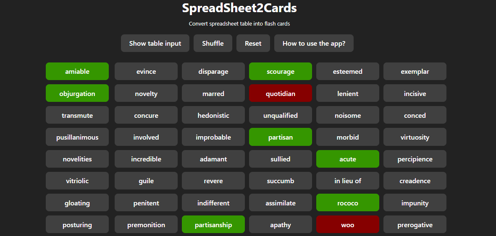
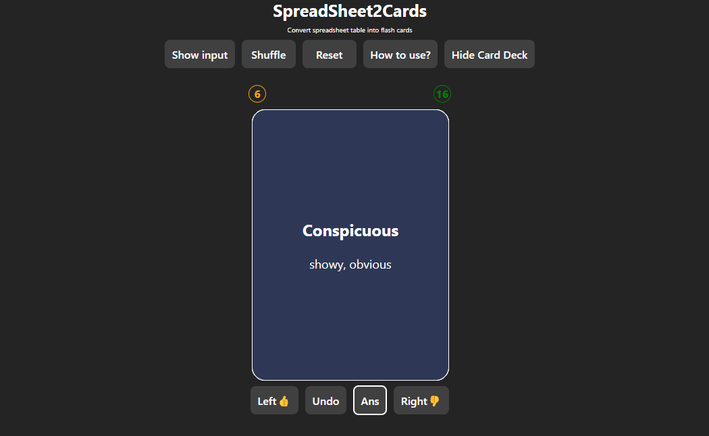
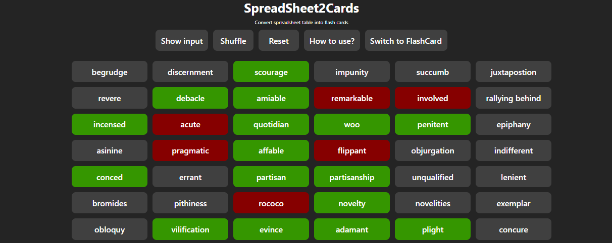

# spreadsheet2cards

Converts spreadsheet table into flash cards.

## Preview

<table>
<tr>
<th>

FlashCardMode

</th>
<th>

KeyBoardMode

</th>
</tr>
</table>

## How to use it?

There are two modes:

<ul>
  <li>FlashCard Mode (default)</li>
  <li>KeyBoard Mode</li>
</ul>
<h3>Instruction for FlashCard Mode</h3>
<ul>
  <li>Swipe left or click left button if you don't know the meaning.</li>
  <li>Swipe right or click right button if you know the meaning.</li>
  <li>Click on the word to toggle visibility of answer for each cards.</li>
  <li>Click on the <strong>Ans</strong> to toggle visibility of all answers.</li>
   <li>
   <strong>Shuffle</strong> button shuffles the words
   </li>
</ul>
<h3>Instruction for KeyBoard Mode</h3>
Click on "Switch to KeyBoard" button to open KeyBoard Mode.
<ul>
    <li>
    <strong>Click on any word</strong>  in the grid to start navigation.
    </li>
    <li>
   <strong>Shuffle</strong> button shuffles the words
    </li>
    <li>
   <strong>Reset</strong> button removes highlights from all words
    </li>
   </ul>    
<table>
  <tr>
    <th>KeyStrokes</th>
    <th>Function</th>
  </tr>
  <tr>
    <td>ArrowKeys</td>
    <td>Navigates in the grid</td>
  </tr>
  <tr>
    <td>Space</td>
    <td>Shows/Hides meanings of current word</td>
  </tr>
  <tr>
    <td>y</td>
    <td>Highlights current word green</td>
  </tr>
  <tr>
    <td>n</td>
    <td>Highlights current word red</td>
  </tr>
  <tr>
    <td>Enter</td>
    <td>Removes highlight from current word</td>
  </tr>
 </table>

### Used Resources

- <a href="https://github.com/codepo8/gridnav">gridnav.js</a>
- <a href="https://github.com/3DJakob/react-tinder-card">react-tinder-card</a>
